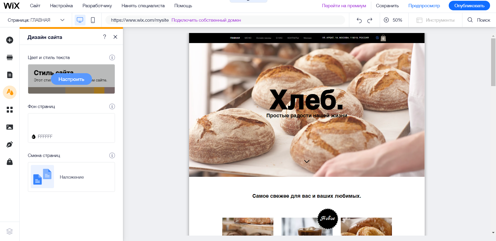

# Як створити сайт пекарні на wix
---
Спочатку нам потрібно зареєструватись на сайті. Далі ми повинні створити новий сайт, перший пункт з вибором категорії сайту ми пропускаємо. В наступному кроці пишемо назву сайту, далі обираємо функціонал сайту. Я пропоную обрати лише функціонал інтернет магазину, але ви можете обрати ще якісь функції. Після цього обираємо створити сайт по шаблону, нам підходить шаблон "Пекарня". Обираємо його через пошук та тиснемо кнопку редагувати. У нас відкриється таке вікно:

---
# Як редагувати текст
---
Клікаємо на будь який текст і тиснемо редагувати

---
# Як змінювати фон
---
Клікаємо на фон і тиснемо змінити фон

---
# Як заміняти фото
---
Клікаємо на фото і тиснемо замінити фото

---
## Таким чином змінюємо усі елементи сайту
---
# Інший Варіант - ми можемо використати швидке редаування секції
---
Для цього клікаємо на секцію і обираємо швидке редагування

В панелі зліва можна редагувати різні елементи

# Як редагувати меню
---
Клікаємо на меню і тиснемо налаштувати

---
# Як змінити кольори
---
Тиснемо сюди:

І обираємо кольори:

---
# Як додати свої секції
---
Клікаємо на кнопку додати секцію

Обираємо секцію і додаємо її

---
# Як опублікувати сайт
---
Тиснемо кнопку опублікувати і обираємо безкоштовний домен

Далі нам видасть посилання на наш сайт

---
# Тепер наш сайт повністю готовий
---
## Сподіваюся мій туторіал був корисним!